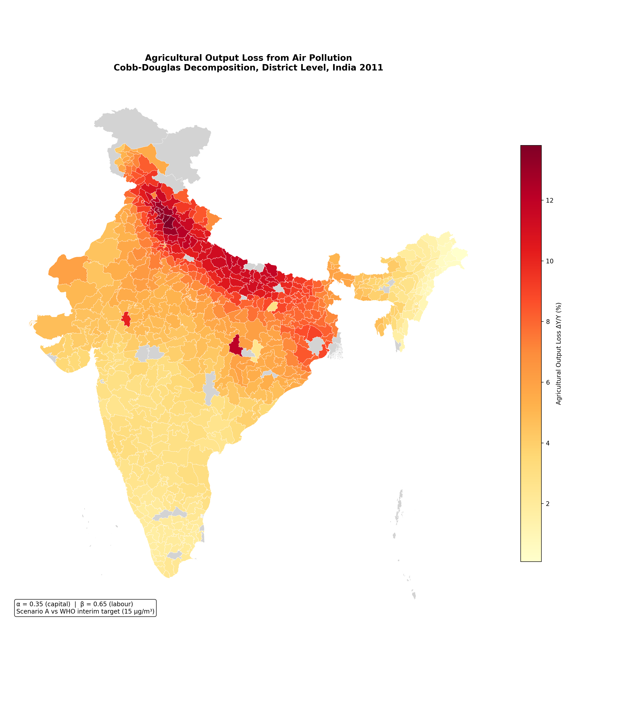
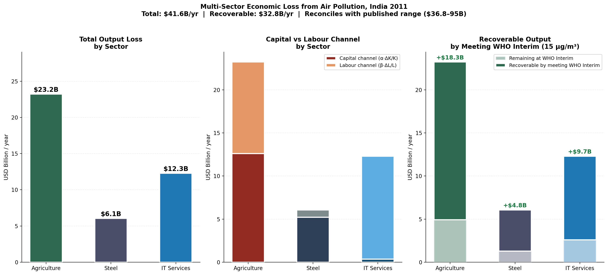
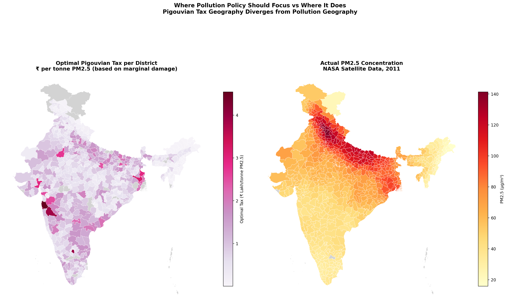
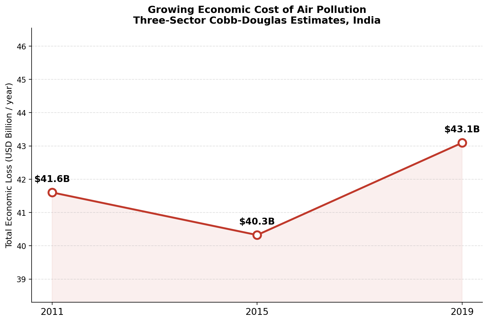
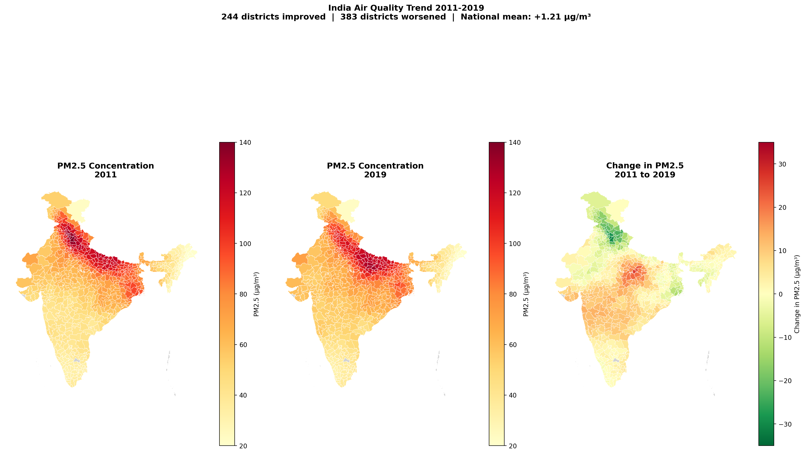
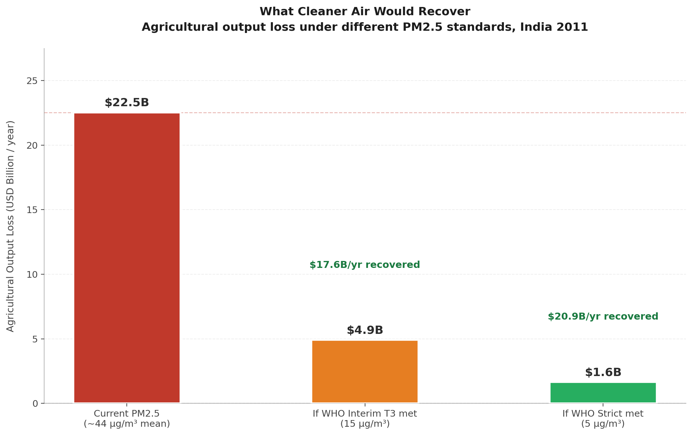

# Air Pollution and Economic Loss in India
### A District-Level Analysis Using Cobb-Douglas Production Theory

Arshia Bajpai  |  BSc Environmental Studies, Economics minor  
TERI School of Advanced Studies, New Delhi  |  2026

---

## What this project is about

Air pollution in India costs the economy tens of billions of dollars 
every year. But that cost is not distributed evenly, it falls 
differently on different sectors, different kinds of workers, and 
different parts of the country. This project tries to measure that 
distribution as precisely as the available data allows.

The analysis uses real NASA satellite PM2.5 readings for every Indian 
district, combined with a Cobb-Douglas production framework to estimate 
how much output each district loses to pollution through two channels: 
damage to physical capital like corroded machinery and crop yield loss, 
and damage to labour through mortality, illness, and cognitive 
impairment.

---

## Data

**Air quality:** NASA/Columbia University Global Annual PM2.5 Grids, 
V4.GL.03. Annual averages for 2011, 2015, and 2019. Each file is a 
global raster at 0.01 degree resolution, cropped to India and sampled 
at district centroids.

**Socioeconomic:** Census of India 2011, district level, 640 districts.

**Geographic:** Census 2011 district shapefiles via DataMeet India.

---

## Framework

The core formula is the Cobb-Douglas damage decomposition:

**ΔY/Y = α · (ΔK/K) + β · (ΔL/L)**

Where α and β are the capital and labour income shares for each sector, 
calibrated from RBI KLEMS data and published productivity studies. 
ΔK/K and ΔL/L are the damage rates to capital and labour from PM2.5 
exposure, scaled proportionally to each district's actual satellite 
reading against a reference point of 80 µg/m³ for the 
Indo-Gangetic Plain.

Three sectors are modelled separately because each has a different 
damage profile and a different α/β split.

---

## Sectors and parameters

**Agriculture** (α = 0.35, β = 0.65)  
Damage through crop yield loss from ozone and SOx, and respiratory 
illness among farm workers. The most balanced channel split of the 
three sectors.

**Steel** (α = 0.65, β = 0.35)  
Damage through accelerated corrosion of blast furnaces and industrial 
equipment, and occupational lung disease among workers. Capital channel 
dominates heavily at 86% of total loss.

**IT Services** (α = 0.15, β = 0.85)  
Damage almost entirely through the labour channel: cognitive 
impairment, increased absenteeism, and mortality among knowledge 
workers. The most invisible form of damage in the dataset.

---

## Key findings

**Scale of loss**  
The three-sector aggregate economic loss from PM2.5 pollution in 2011 
was $41.6 billion per year. This sits within the published range of 
$36.8 to $95 billion from the GBD 2019 and Clean Air Fund estimates, 
derived from the ground up using district-level satellite data rather 
than top-down national modelling.

**Channel asymmetry**  
Each sector has a fundamentally different damage structure. Steel loses 
86% of its output through capital damage. IT loses 97% through labour 
damage. Agriculture splits roughly evenly. A single blanket pollution 
policy cannot address all three efficiently.

**Pigouvian tax geography**  
The optimal pollution tax, calculated as marginal damage per tonne of 
PM2.5, is highest not in India's most polluted districts but in its 
most economically productive ones. Thane, Bangalore, Pune, and Mumbai 
Suburban show the highest optimal levies because their large IT 
workforces make the marginal labour damage enormous, even at moderate 
pollution levels. Current policy focuses on the wrong geography.

**Temporal trend**  
Economic losses followed a V-shape between 2011 and 2019. They fell 
slightly to $40.3B in 2015 before rising to $43.1B by 2019, higher 
than the 2011 baseline. 383 of 634 districts saw pollution increase 
over this period. The districts that improved were mostly in the 
northwest corridor, Haryana and western UP, where early interventions 
had some effect. The districts that worsened were concentrated in 
central India, eastern UP and Madhya Pradesh, where industrialization 
expanded without sufficient air quality controls.

**Policy implication**  
India's air quality standards permit PM2.5 levels at which this 
analysis estimates significant economic damage across all three sectors. 
Meeting the WHO interim target of 15 µg/m³ would recover an estimated 
$32.8 billion per year in output. The gap between the legal standard 
and a health-protective standard is not just a public health failure. 
It is a measurable economic one.

---

## Limitations

The damage rates are scaled linearly from reference values calibrated 
to the Indo-Gangetic Plain. Districts with very different industrial 
compositions may have different actual damage rates than the model 
assigns. GDP is allocated by population share, which is a proxy and 
not a direct measure of sectoral output per district. The 2019 data 
predates NCAP's implementation period, so this analysis cannot 
evaluate the programme's effectiveness.

---

## Visualizations

### Agricultural output loss map

### Multi-sector loss and channel decomposition

### Optimal Pigouvian tax vs actual pollution geography

### Temporal trend in economic losses 2011-2019

### Air quality change map 2011-2019

### Policy scenario comparison

---

## Tools

Python, Pandas, NumPy, PIL, GeoPandas, Scikit-learn, 
Matplotlib, Jupyter Notebook

---

## Related work

This project is a companion to 
[Climate Vulnerability Assessment of Indian Districts](https://github.com/arshia-bajpai/india-climate-vulnerability). 
Together the two projects examine different dimensions of 
environmental risk in India using consistent data and methods.

---

## About

Independent research project. The theoretical framework draws on 
Pigou (1920), Cobb and Douglas (1928), and Olson (1965). Damage 
parameters are calibrated from RBI KLEMS, Hsieh and Klenow (2009), 
and Bosworth and Collins (2008). Satellite data from NASA SEDAC.
